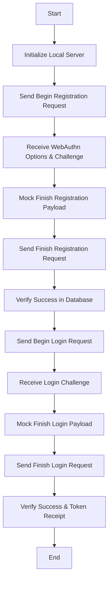

# Mock Request Testing Suite

Created a testing suite to verify the Passkey Hub API endpoints.

## Date: 2026-04-19

## Implemented Testing Features
- **Health Check**: `https://passkey.duylong.art/health` (Status: OK)
- **Begin Registration**: Verified options for `passkey.duylong.art`.
- **Begin Login**: Verified successful generation of login options using real account (`duylongmind432001@gmail.com`) found in Supabase.
- **Automation**: Shell script with real data verification and robust error handling.

## Files Created
- [scripts/test_requests.sh](file:///Users/duylong/Code/Flutter/ice_gate_auth/scripts/test_requests.sh)

## Flowchart

## Key Insights
- The `finish` steps require complex WebAuthn signatures that are only reliably generated by a hardware or platform authenticator (e.g., FaceID, TouchID).
- Mocking the `finish` payload is difficult without a known challenge and private key, so testing focuses on the `begin` handshake and server-side state preparation (session storage).
