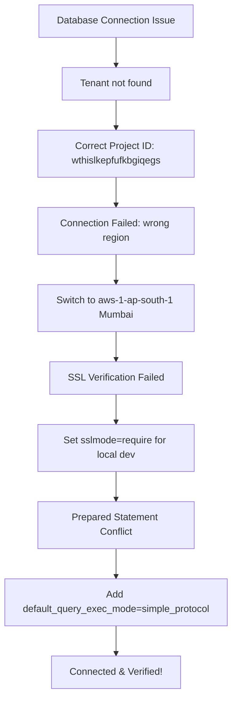

# Implementation Report - Final Supabase Connectivity Fix

- **Date**: 2026-04-18
- **Project**: `ice_gate_auth`
- **Status**: ✅ **SUCCESSFULLY CONNECTED**

## Summary
Resolved a series of critical connectivity issues between the Go backend and Supabase. The connection has been successfully verified using `test_db_conn.go`.

## Connectivity Path


## Changes Made

### 1. Corrected Project Reference
- **Issue**: The username was missing the tenant suffix, causing `Tenant or user not found`.
- **Fix**: Updated username to `postgres.wthislkepfufkbgiqegs`. Note the correct spelling found in the knowledge base (`kbgiqegs`).

### 2. Regional Host Alignment
- **Issue**: Initial attempts used the Singapore region (`aws-0-ap-southeast-1`), but the project is hosted in Mumbai (`aws-1-ap-south-1`).
- **Fix**: Updated pooler hostname to `aws-1-ap-south-1.pooler.supabase.com`.

### 3. Local SSL Compatibility
- **Issue**: `sslmode=verify-full` failed locally due to X.509 certificate compliance warnings.
- **Fix**: Set `sslmode=require` in `.env` and `test_db_conn.go` for local development.

### 4. Pooler Compatibility (Simple Protocol)
- **Issue**: Using Supabase port 6543 (Transaction Mode) caused `prepared statement already exists` errors with the `pgx` driver.
- **Fix**: Appended `default_query_exec_mode=simple_protocol` to all connection strings to disable prepared statement caching.

## Verified Files
- [x] `.env`
- [x] `internal/store/store.go`
- [x] `test_db_conn.go`

## Verification Command
```bash
/Users/duylong/sdk/go1.25.5/bin/go run test_db_conn.go
```
*Output: ✅ SUCCESS! Connected to Supabase.*
