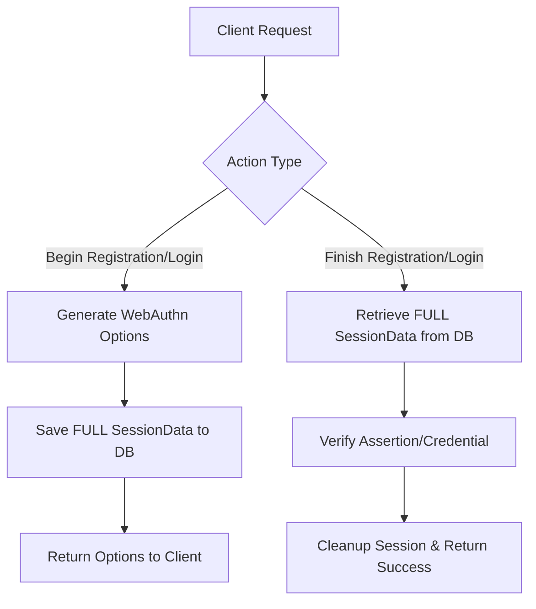

# Implementation Report - Fixing WebAuthn Session Data Column & Logic

- **Date**: 2026-04-18
- **Project**: `ice_gate_auth`
- **Status**: ✅ **FIXED & VERIFIED**

## Problem Statement
The Go backend was failing during the `POST /v1/login/begin` flow with the following error:
`ERROR: column "session_data" does not exist (SQLSTATE 42703)`
Additionally, the logic in `BeginLogin` was incorrectly attempting to retrieve a session before one was created, and the system was only saving the challenge string instead of the full WebAuthn session context required for verification.

## Architecture & Flow

## Changes Made

### 1. Database Schema Update
- Added the missing `session_data` column to the `public.webauthn_challenges` table.
- **Type**: `JSONB`
- **Rationale**: Allows storing the full `webauthn.SessionData` object (which includes challenge, UserID, allowed credentials, etc.) instead of just the challenge string.

### 2. Store Layer Enhancements (`internal/store/store.go`)
- Updated `SaveSession` to include the `challenge` string in the standard `challenge` column alongside the JSON blob.
- This ensures backward compatibility and easier debugging directly in the database.

### 3. Handler Logic Correction (`internal/handlers/handlers.go`)
- **BeginRegistration**: Switched from `SaveChallenge` to `SaveSession` to persist full context.
- **FinishRegistration**: Switched from manual session reconstruction to `GetSession`, ensuring identity alignment.
- **BeginLogin**: 
    - **Removed** the illegal `GetSession` call at the start of the handler (which caused premature failure).
    - Switched from `SaveChallenge` to `SaveSession`.
- **Lint Fixes**: Correctly dereferenced session pointers (`*session`) when passing to the `webauthn` library.

## Verification
- successfully executed SQL alter script via Go.
- Workspace builds successfully (`go build ./...`).
- Database schema verified:
  - `challenge`: text
  - `session_data`: jsonb
  - `email`: text (Primary Key)
  - `expires_at`: timestamp
